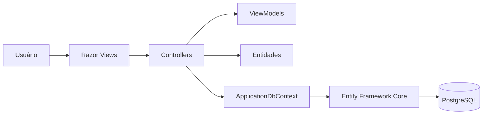
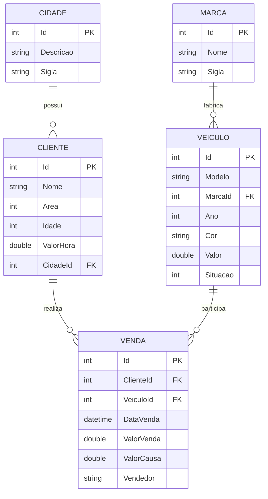
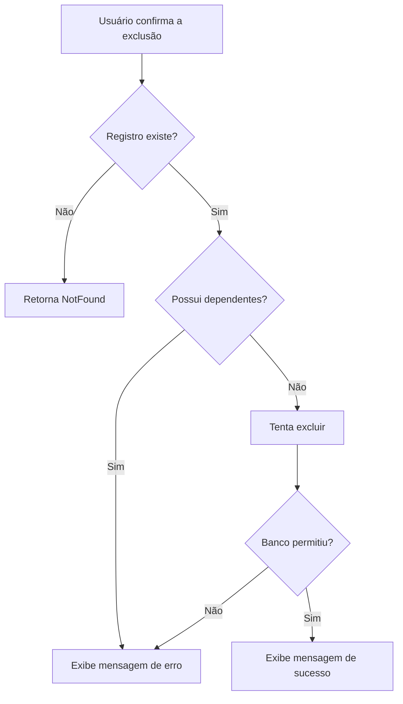

# StockCar Manager

<p align="center">
  
</p>

Aplicação web para gerenciar o catálogo, os clientes e as vendas de uma loja de veículos. O sistema reúne os cadastros de cidades, marcas, veículos e clientes, registra negociações e apresenta um resumo da operação em um dashboard.

## Funcionalidades

| Módulo | Recursos |
| --- | --- |
| Dashboard | Totais de veículos, disponíveis, clientes, vendas e valor vendido |
| Cidades | Cadastro, listagem, detalhes, edição e exclusão |
| Marcas | Cadastro, listagem, detalhes, edição e exclusão |
| Clientes | Cadastro com cidade e área profissional, listagem, detalhes, edição e exclusão |
| Veículos | Cadastro com marca, controle de situação, listagem, detalhes, edição e exclusão |
| Vendas | Associação entre cliente e veículo, valores, vendedor, data, edição e exclusão |

As listagens possuem confirmação antes da exclusão e mensagens visuais de sucesso ou erro. Os formulários contam com validação e placeholders, e os títulos utilizam os mesmos ícones presentes no menu lateral.

## Tecnologias

| Camada | Tecnologia |
| --- | --- |
| Plataforma | .NET 10 |
| Backend | ASP.NET Core MVC |
| Persistência | Entity Framework Core 10 |
| Banco de dados | PostgreSQL 17 |
| Provider | Npgsql.EntityFrameworkCore.PostgreSQL |
| Interface | Razor Views e Tailwind CSS |
| Ícones | Lucide Icons |
| Validação no navegador | jQuery Validation e Unobtrusive Validation |
| Containers | Docker e Docker Compose |

## Arquitetura

A aplicação segue o padrão MVC:



- **Models:** entidades e regras básicas de domínio.
- **ViewModels:** dados e validações dos formulários.
- **Controllers:** recebem requisições, aplicam os fluxos e acessam o banco.
- **Views:** páginas Razor exibidas ao usuário.
- **Data:** configuração do contexto do Entity Framework Core.
- **Migrations:** histórico das alterações do banco.
- **wwwroot:** CSS, JavaScript, imagens e bibliotecas do frontend.

A rota convencional é configurada em `Program.cs`:

```text
/{controller=Home}/{action=Index}/{id?}
```

## Modelo de domínio



### Entidades e validações

| Entidade | Principais dados | Regras |
| --- | --- | --- |
| Cidade | Descrição e sigla | Descrição única com até 100 caracteres; sigla única com 2 a 3 letras |
| Marca | Nome e sigla | Nome único com até 50 caracteres; sigla única com até 10 letras |
| Cliente | Nome, área, idade, valor/hora e cidade | Idade entre 18 e 150 anos; cidade obrigatória; valor/hora não negativo |
| Veículo | Modelo, marca, ano, cor, valor e situação | Ano entre 1950 e o próximo ano; valor positivo; marca obrigatória |
| Venda | Cliente, veículo, data, valores e vendedor | Data não futura; valor da venda positivo; cliente e veículo obrigatórios |

Áreas de cliente: CLT, servidor público, autônomo, empresário, aposentado, estudante e outro.

Situações de veículo: disponível, reservado, vendido e em manutenção.

## Regras de negócio

1. Cidades e marcas não podem repetir seus nomes ou siglas.
2. Todo cliente deve estar associado a uma cidade existente.
3. Todo veículo deve estar associado a uma marca existente.
4. Uma venda só pode ser criada com um veículo disponível.
5. Ao registrar uma venda, o veículo passa para `Vendido`.
6. Ao trocar o veículo de uma venda, o anterior volta para `Disponível` e o novo passa para `Vendido`.
7. Ao excluir uma venda, o veículo relacionado volta para `Disponível`.
8. A data da venda não pode estar no futuro.
9. Registros que possuem dependentes não podem ser excluídos.

As entidades utilizam setters privados e métodos como `SetNome`, `SetAno`, `SetValor`, `SetSituacao` e `SetDataVenda` para proteger suas alterações.

## Proteção das exclusões

Os relacionamentos usam `DeleteBehavior.Restrict`. Dessa forma, o PostgreSQL preserva a integridade dos dados e impede exclusões como:

- excluir uma cidade que possui clientes;
- excluir uma marca que possui veículos;
- excluir um cliente que possui vendas;
- excluir um veículo que possui vendas.

Antes da exclusão, cada controller consulta a existência de dependentes com `AnyAsync`. A operação também trata `DbUpdateException`, protegendo contra alterações simultâneas entre a consulta e o salvamento.



As mensagens são transportadas pelos controllers usando `TempData` e exibidas nas páginas de listagem:

- alerta verde para exclusões concluídas;
- alerta vermelho quando o registro está relacionado a outro dado.

## Estrutura do projeto

```text
GerenciadorVendaVeiculos/
├── compose.yaml
├── GerenciadorVendaVeiculos.sln
└── GerenciadorVendaVeiculos/
    ├── Controllers/       # Fluxos MVC
    ├── Data/              # ApplicationDbContext
    ├── Migrations/        # Histórico do banco
    ├── Models/            # Entidades e enums
    │   └── ViewModels/    # Modelos dos formulários
    ├── Views/             # Páginas Razor
    ├── wwwroot/           # CSS, JavaScript e imagens
    ├── appsettings.json
    ├── Dockerfile
    ├── GerenciadorVendaVeiculos.csproj
    └── Program.cs
```

## Como executar

### Pré-requisitos

- [.NET SDK 10](https://dotnet.microsoft.com/download);
- PostgreSQL local ou Docker;
- Docker Compose V2, caso utilize os containers;
- ferramenta `dotnet-ef` compatível com o Entity Framework Core 10.

### Execução local

Clone o repositório:

```bash
git clone https://github.com/DarioKlein/gerenciador-venda-de-veiculos-dotnet-mvc.git
cd gerenciador-venda-de-veiculos-dotnet-mvc
```

Inicie o PostgreSQL:

```bash
docker compose up -d postgres
```

Restaure os pacotes:

```bash
dotnet restore GerenciadorVendaVeiculos.sln
```

Instale o `dotnet-ef`, caso ainda não esteja disponível:

```bash
dotnet tool install --global dotnet-ef --version 10.*
```

Aplique as migrations:

```bash
dotnet ef database update --project GerenciadorVendaVeiculos/GerenciadorVendaVeiculos.csproj
```

Execute a aplicação:

```bash
dotnet run --project GerenciadorVendaVeiculos/GerenciadorVendaVeiculos.csproj
```

Acesse `http://localhost:5068` ou `https://localhost:7010`.

### Execução com Docker

Na primeira execução, inicie o banco e aplique as migrations:

```bash
docker compose up -d postgres
dotnet ef database update --project GerenciadorVendaVeiculos/GerenciadorVendaVeiculos.csproj
```

Depois, construa e inicie a aplicação:

```bash
docker compose up --build
```

Acesse `http://localhost:8080`. Para encerrar os containers, execute `docker compose down`. O volume `postgres_data` preserva os dados entre as execuções.

## Banco de dados e migrations

A aplicação usa a connection string `DefaultConnection`, configurada em `appsettings.json`. No ambiente local, o PostgreSQL é exposto na porta `5433`. Dentro do Docker Compose, a aplicação acessa o serviço `postgres` pela porta `5432`.

Comandos principais:

```bash
# Aplicar migrations pendentes
dotnet ef database update --project GerenciadorVendaVeiculos/GerenciadorVendaVeiculos.csproj

# Criar uma migration
dotnet ef migrations add NomeDaMigration --project GerenciadorVendaVeiculos/GerenciadorVendaVeiculos.csproj

# Listar migrations
dotnet ef migrations list --project GerenciadorVendaVeiculos/GerenciadorVendaVeiculos.csproj
```

A migration `RestringirExclusaoEmCascata` altera as chaves estrangeiras para `Restrict`, impedindo que cidades, marcas, clientes ou veículos apaguem registros relacionados automaticamente.

## Rotas principais

| Módulo | Listagem | Cadastro | Detalhes | Edição |
| --- | --- | --- | --- | --- |
| Home | `/` | - | - | - |
| Cidades | `/Cidade` | `/Cidade/Create` | `/Cidade/Details/{id}` | `/Cidade/Edit/{id}` |
| Marcas | `/Marca` | `/Marca/Create` | `/Marca/Details/{id}` | `/Marca/Edit/{id}` |
| Clientes | `/Cliente` | `/Cliente/Create` | `/Cliente/Details/{id}` | `/Cliente/Edit/{id}` |
| Veículos | `/Veiculo` | `/Veiculo/Create` | `/Veiculo/Details/{id}` | `/Veiculo/Edit/{id}` |
| Vendas | `/Venda` | `/Venda/Create` | `/Venda/Details/{id}` | `/Venda/Edit/{id}` |

As exclusões são enviadas por `POST` e protegidas por token antifalsificação.

## Interface e validação

A interface possui menu lateral responsivo, tabelas, formulários, indicadores de situação e janelas de confirmação. Tailwind CSS, fontes e ícones Lucide são carregados por CDN.

A validação acontece em três camadas:

1. **ViewModels:** validam os dados recebidos pelos formulários.
2. **Entidades:** aplicam regras de domínio antes de alterar propriedades.
3. **Banco:** protege chaves estrangeiras, campos obrigatórios e índices únicos.

---

Projeto desenvolvido para estudo de ASP.NET Core MVC, Entity Framework Core e PostgreSQL.
