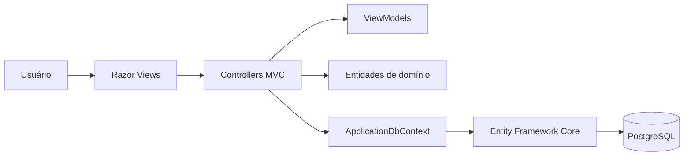
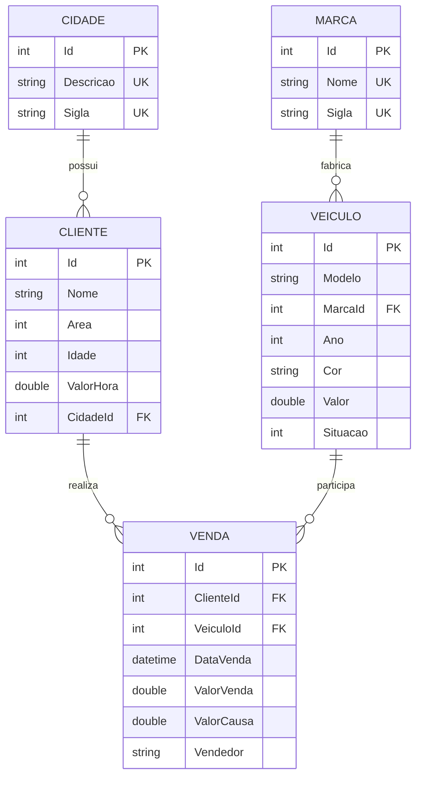

# StockCar Manager — Gerenciador de Venda de Veículos

<p align="center">
  
</p>

Aplicação web para administrar o catálogo, os clientes e as vendas de uma loja de veículos. O sistema centraliza o cadastro de cidades, marcas, veículos e clientes, além de registrar vendas e acompanhar indicadores básicos por meio de um dashboard.

O projeto foi desenvolvido com ASP.NET Core MVC, Entity Framework Core e PostgreSQL. A interface usa Razor Views, Tailwind CSS e ícones Lucide.

## Sumário

- [Funcionalidades](#funcionalidades)
- [Tecnologias](#tecnologias)
- [Arquitetura](#arquitetura)
- [Modelo de domínio](#modelo-de-domínio)
- [Regras de negócio](#regras-de-negócio)
- [Estrutura do projeto](#estrutura-do-projeto)
- [Pré-requisitos](#pré-requisitos)
- [Execução local](#execução-local)
- [Execução com Docker](#execução-com-docker)
- [Configuração do banco de dados](#configuração-do-banco-de-dados)
- [Migrations](#migrations)
- [Rotas principais](#rotas-principais)
- [Validações](#validações)
- [Interface](#interface)
- [Build e publicação](#build-e-publicação)
- [Solução de problemas](#solução-de-problemas)
- [Estado atual e limitações](#estado-atual-e-limitações)

## Funcionalidades

### Dashboard

A página inicial apresenta um resumo da operação:

- quantidade total de veículos;
- quantidade de veículos disponíveis;
- quantidade de clientes cadastrados;
- quantidade de vendas registradas;
- valor total movimentado em vendas;
- atalhos para os principais módulos.

### Cidades

- cadastro de cidade;
- listagem das cidades cadastradas;
- visualização de detalhes;
- edição;
- exclusão com confirmação;
- validação de descrição e sigla;
- unicidade de descrição e sigla no banco de dados.

### Marcas

- cadastro de fabricantes;
- listagem das marcas cadastradas;
- visualização de detalhes;
- edição;
- exclusão com confirmação;
- validação de nome e sigla;
- unicidade de nome e sigla no banco de dados.

### Clientes

- cadastro de cliente;
- associação do cliente a uma cidade;
- seleção da área de atuação;
- registro de idade e valor por hora;
- listagem, detalhes, edição e exclusão.

### Veículos

- cadastro de veículo associado a uma marca;
- registro de modelo, ano, cor, valor e situação;
- controle dos estados disponível, reservado, vendido e em manutenção;
- listagem, detalhes, edição e exclusão;
- identificação visual da situação na listagem.

### Vendas

- associação entre cliente e veículo;
- seleção de veículos disponíveis no cadastro da venda;
- registro da data, valor da venda, valor da causa e vendedor;
- alteração automática do veículo para o estado `Vendido` ao registrar a venda;
- retorno do veículo ao estado `Disponível` quando a venda é excluída;
- listagem, detalhes, edição e exclusão.

## Tecnologias

| Camada | Tecnologia |
| --- | --- |
| Plataforma | .NET 10 |
| Backend | ASP.NET Core MVC |
| ORM | Entity Framework Core 10 |
| Banco de dados | PostgreSQL 17 |
| Provider do banco | Npgsql.EntityFrameworkCore.PostgreSQL |
| Views | Razor Views |
| Estilização | Tailwind CSS via CDN |
| Ícones | Lucide Icons via CDN |
| Validação no cliente | jQuery Validation e Unobtrusive Validation |
| Containers | Docker e Docker Compose |

Principais pacotes NuGet:

- `Microsoft.EntityFrameworkCore.Design`;
- `Microsoft.EntityFrameworkCore.Tools`;
- `Microsoft.VisualStudio.Web.CodeGeneration.Design`;
- `Npgsql.EntityFrameworkCore.PostgreSQL`.

## Arquitetura

A aplicação segue o padrão MVC:



- **Models:** representam as entidades e concentram regras básicas de domínio.
- **ViewModels:** definem os dados e as validações usados pelos formulários.
- **Controllers:** processam as requisições, consultam o banco e selecionam as views.
- **Views:** renderizam a interface HTML com Razor e Tag Helpers.
- **Data:** contém o contexto do Entity Framework Core.
- **Migrations:** registram a evolução do esquema do PostgreSQL.
- **wwwroot:** armazena CSS, JavaScript, imagens e bibliotecas do frontend.

O ponto de entrada está em `Program.cs`. Nele são configurados o MVC, o `ApplicationDbContext`, os arquivos estáticos, o tratamento de erros e a rota convencional:

```text
/{controller=Home}/{action=Index}/{id?}
```

## Modelo de domínio



### Entidades

#### Cidade

| Campo | Tipo | Regra principal |
| --- | --- | --- |
| `Id` | `int` | chave primária gerada pelo banco |
| `Descricao` | `string` | obrigatória, até 100 caracteres e única |
| `Sigla` | `string` | obrigatória, de 2 a 3 letras e única |

#### Marca

| Campo | Tipo | Regra principal |
| --- | --- | --- |
| `Id` | `int` | chave primária gerada pelo banco |
| `Nome` | `string` | obrigatório, até 50 caracteres e único |
| `Sigla` | `string` | obrigatória, até 10 letras e única |

#### Cliente

| Campo | Tipo | Regra principal |
| --- | --- | --- |
| `Id` | `int` | chave primária gerada pelo banco |
| `Nome` | `string` | obrigatório e limitado a 100 caracteres |
| `Area` | `TipoArea` | área profissional do cliente |
| `Idade` | `int` | validada pelo formulário entre 18 e 150 anos |
| `ValorHora` | `double` | não pode ser negativo |
| `CidadeId` | `int` | chave estrangeira obrigatória para cidade |

Áreas disponíveis: CLT, servidor público, autônomo, empresário, aposentado, estudante e outro.

#### Veículo

| Campo | Tipo | Regra principal |
| --- | --- | --- |
| `Id` | `int` | chave primária gerada pelo banco |
| `Modelo` | `string` | obrigatório e limitado a 60 caracteres |
| `MarcaId` | `int` | chave estrangeira obrigatória para marca |
| `Ano` | `int` | entre 1950 e o próximo ano |
| `Cor` | `string` | obrigatória e limitada a 30 caracteres |
| `Valor` | `double` | deve ser maior que zero |
| `Situacao` | `SituacaoVeiculo` | estado atual do veículo |

Situações disponíveis: disponível, reservado, vendido e em manutenção.

#### Venda

| Campo | Tipo | Regra principal |
| --- | --- | --- |
| `Id` | `int` | chave primária gerada pelo banco |
| `ClienteId` | `int` | cliente associado à venda |
| `VeiculoId` | `int` | veículo associado à venda |
| `DataVenda` | `DateTime` | não pode ser futura |
| `ValorVenda` | `double` | deve ser maior que zero |
| `ValorCausa` | `double` | não pode ser negativo |
| `Vendedor` | `string` | obrigatório e limitado a 100 caracteres |

## Regras de negócio

As principais regras implementadas são:

1. uma cidade deve ter descrição e sigla válidas;
2. nomes e siglas de cidades não podem se repetir;
3. nomes e siglas de marcas não podem se repetir;
4. todo cliente deve estar associado a uma cidade existente;
5. todo veículo deve estar associado a uma marca existente;
6. o ano do veículo deve estar entre 1950 e o ano seguinte ao atual;
7. o valor do veículo e o valor da venda devem ser maiores que zero;
8. a data da venda não pode estar no futuro;
9. o cadastro de venda apresenta apenas veículos disponíveis;
10. ao concluir uma venda, o veículo é marcado como vendido;
11. ao excluir uma venda, o veículo relacionado volta a ficar disponível.

As entidades possuem setters privados. Alterações relevantes passam por métodos como `SetNome`, `SetAno`, `SetValor`, `SetSituacao` e `SetDataVenda`, mantendo parte das validações dentro do domínio.

## Estrutura do projeto

```text
GerenciadorVendaVeiculos/
├── compose.yaml
├── GerenciadorVendaVeiculos.sln
└── GerenciadorVendaVeiculos/
    ├── Controllers/
    │   ├── CidadeController.cs
    │   ├── ClienteController.cs
    │   ├── HomeController.cs
    │   ├── MarcaController.cs
    │   ├── VeiculoController.cs
    │   └── VendaController.cs
    ├── Data/
    │   └── ApplicationDbContext.cs
    ├── Migrations/
    ├── Models/
    │   ├── ViewModels/
    │   ├── Cidade.cs
    │   ├── Cliente.cs
    │   ├── Marca.cs
    │   ├── Veiculo.cs
    │   └── Venda.cs
    ├── Properties/
    │   └── launchSettings.json
    ├── Views/
    │   ├── Cidade/
    │   ├── Cliente/
    │   ├── Home/
    │   ├── Marca/
    │   ├── Shared/
    │   ├── Veiculo/
    │   └── Venda/
    ├── wwwroot/
    │   ├── css/
    │   ├── img/
    │   ├── js/
    │   └── lib/
    ├── appsettings.json
    ├── Dockerfile
    ├── GerenciadorVendaVeiculos.csproj
    └── Program.cs
```

## Pré-requisitos

Para executar diretamente na máquina:

- [.NET SDK 10](https://dotnet.microsoft.com/download);
- PostgreSQL, localmente ou por Docker;
- ferramenta `dotnet-ef` compatível com o Entity Framework Core 10;
- Git, caso o projeto seja clonado do repositório.

Para executar toda a infraestrutura em containers:

- Docker Desktop ou Docker Engine;
- Docker Compose V2.

## Execução local

### 1. Clone o repositório

```bash
git clone https://github.com/DarioKlein/gerenciador-venda-de-veiculos-dotnet-mvc.git
cd gerenciador-venda-de-veiculos-dotnet-mvc
```

### 2. Inicie somente o PostgreSQL pelo Docker

```bash
docker compose up -d postgres
```

O PostgreSQL será disponibilizado em `localhost:5433`.

### 3. Restaure as dependências

```bash
dotnet restore GerenciadorVendaVeiculos.sln
```

### 4. Instale a ferramenta do Entity Framework Core, se necessário

```bash
dotnet tool install --global dotnet-ef --version 10.*
```

Se ela já estiver instalada:

```bash
dotnet tool update --global dotnet-ef --version 10.*
```

### 5. Aplique as migrations

```bash
dotnet ef database update \
  --project GerenciadorVendaVeiculos/GerenciadorVendaVeiculos.csproj \
  --startup-project GerenciadorVendaVeiculos/GerenciadorVendaVeiculos.csproj
```

No PowerShell, o mesmo comando pode ser executado em uma única linha:

```powershell
dotnet ef database update --project GerenciadorVendaVeiculos/GerenciadorVendaVeiculos.csproj --startup-project GerenciadorVendaVeiculos/GerenciadorVendaVeiculos.csproj
```

### 6. Execute a aplicação

```bash
dotnet run --project GerenciadorVendaVeiculos/GerenciadorVendaVeiculos.csproj
```

Endereços definidos no perfil de desenvolvimento:

- HTTP: `http://localhost:5068`;
- HTTPS: `https://localhost:7010`.

Caso o navegador apresente um aviso sobre o certificado HTTPS de desenvolvimento, confie no certificado com:

```bash
dotnet dev-certs https --trust
```

## Execução com Docker

Os comandos desta seção devem ser executados na raiz do repositório, onde está o arquivo `compose.yaml`.

### Primeira execução

Inicie o banco:

```bash
docker compose up -d postgres
```

Depois que o PostgreSQL estiver pronto, aplique as migrations usando o SDK instalado na máquina:

```bash
dotnet ef database update \
  --project GerenciadorVendaVeiculos/GerenciadorVendaVeiculos.csproj \
  --startup-project GerenciadorVendaVeiculos/GerenciadorVendaVeiculos.csproj
```

Em seguida, construa e inicie a aplicação:

```bash
docker compose up --build
```

A aplicação ficará disponível em:

```text
http://localhost:8080
```

### Execuções seguintes

```bash
docker compose up -d
```

### Acompanhar os logs

```bash
docker compose logs -f gerenciadorvendaveiculos
```

### Encerrar os containers

```bash
docker compose down
```

Os dados permanecem armazenados no volume `postgres_data`.

Para também remover o volume e apagar os dados do ambiente Docker:

```bash
docker compose down -v
```

> Atenção: o comando acima remove permanentemente o banco armazenado no volume Docker.

## Configuração do banco de dados

A aplicação lê a conexão pelo nome `DefaultConnection`.

Configuração local atualmente usada em `appsettings.json`:

```text
Host=localhost;Port=5433;Database=gerenciadorvendaveiculos;Username=postgres;Password=postgres
```

No Docker Compose, a aplicação se conecta ao serviço `postgres` pela porta interna `5432`:

```text
Host=postgres;Port=5432;Database=gerenciadorvendaveiculos;Username=postgres;Password=postgres
```

A configuração pode ser sobrescrita por uma variável de ambiente. No PowerShell:

```powershell
$env:ConnectionStrings__DefaultConnection = "Host=localhost;Port=5433;Database=gerenciadorvendaveiculos;Username=seu_usuario;Password=sua_senha"
dotnet run --project GerenciadorVendaVeiculos/GerenciadorVendaVeiculos.csproj
```

Em Bash:

```bash
export ConnectionStrings__DefaultConnection="Host=localhost;Port=5433;Database=gerenciadorvendaveiculos;Username=seu_usuario;Password=sua_senha"
dotnet run --project GerenciadorVendaVeiculos/GerenciadorVendaVeiculos.csproj
```

As credenciais presentes no repositório são adequadas apenas para desenvolvimento. Em produção, use variáveis de ambiente ou um gerenciador de segredos.

## Migrations

### Aplicar migrations pendentes

```bash
dotnet ef database update --project GerenciadorVendaVeiculos/GerenciadorVendaVeiculos.csproj
```

### Listar migrations

```bash
dotnet ef migrations list --project GerenciadorVendaVeiculos/GerenciadorVendaVeiculos.csproj
```

### Criar uma migration

```bash
dotnet ef migrations add NomeDaMigration --project GerenciadorVendaVeiculos/GerenciadorVendaVeiculos.csproj
```

### Remover a última migration ainda não aplicada

```bash
dotnet ef migrations remove --project GerenciadorVendaVeiculos/GerenciadorVendaVeiculos.csproj
```

> Remover ou reverter migrations que já foram aplicadas pode causar perda de dados. Verifique o ambiente antes de executar operações destrutivas.

O histórico atual inclui a criação das entidades, seus relacionamentos, o ajuste do tipo da data de venda e os índices únicos de cidade e marca.

## Rotas principais

| Módulo | Listagem | Cadastro | Detalhes | Edição |
| --- | --- | --- | --- | --- |
| Home | `/` ou `/Home/Index` | — | — | — |
| Cidades | `/Cidade` | `/Cidade/Create` | `/Cidade/Details/{id}` | `/Cidade/Edit/{id}` |
| Marcas | `/Marca` | `/Marca/Create` | `/Marca/Details/{id}` | `/Marca/Edit/{id}` |
| Clientes | `/Cliente` | `/Cliente/Create` | `/Cliente/Details/{id}` | `/Cliente/Edit/{id}` |
| Veículos | `/Veiculo` | `/Veiculo/Create` | `/Veiculo/Details/{id}` | `/Veiculo/Edit/{id}` |
| Vendas | `/Venda` | `/Venda/Create` | `/Venda/Details/{id}` | `/Venda/Edit/{id}` |

As exclusões são enviadas por `POST` a partir das janelas de confirmação presentes nas páginas de listagem. Os formulários usam proteção antifalsificação do ASP.NET Core.

## Validações

A validação ocorre em mais de uma camada:

1. **ViewModels:** atributos como `Required`, `MaxLength`, `Range`, `Display` e `DataType` validam os dados dos formulários.
2. **Entidades:** construtores e métodos de alteração aplicam regras de domínio e lançam exceções para valores inválidos.
3. **Banco de dados:** chaves estrangeiras, campos obrigatórios e índices únicos reforçam a integridade dos dados.
4. **Cliente:** jQuery Validation e Unobtrusive Validation exibem mensagens antes do envio quando aplicável.

Os formulários também possuem textos de exemplo nos campos por meio de placeholders.

## Interface

A interface foi organizada com:

- menu lateral responsivo;
- navegação agrupada em catálogo, comercial e cadastros;
- indicação visual do módulo ativo;
- ícones Lucide coerentes entre o menu e os títulos das páginas;
- tabelas responsivas para as listagens;
- formulários com mensagens de validação;
- modais de confirmação para exclusões;
- indicadores visuais para área profissional e situação do veículo;
- layout adaptado para dispositivos móveis e desktop.

O Tailwind CSS e os ícones Lucide são carregados por CDN. Portanto, o navegador precisa de acesso à internet para carregar toda a estilização e os ícones no estado atual do projeto.

## Build e publicação

### Compilar em modo Debug

```bash
dotnet build GerenciadorVendaVeiculos.sln
```

### Compilar em modo Release

```bash
dotnet build GerenciadorVendaVeiculos.sln --configuration Release
```

### Publicar

```bash
dotnet publish GerenciadorVendaVeiculos/GerenciadorVendaVeiculos.csproj \
  --configuration Release \
  --output ./publish
```

### Construir somente a imagem Docker

```bash
docker build \
  -f GerenciadorVendaVeiculos/Dockerfile \
  -t gerenciadorvendaveiculos .
```

O `Dockerfile` utiliza múltiplos estágios para restaurar, compilar e publicar a aplicação, mantendo apenas o runtime ASP.NET Core na imagem final.

## Solução de problemas

### Erro de conexão com o PostgreSQL

Confirme se o container está em execução:

```bash
docker compose ps
```

Consulte os logs do banco:

```bash
docker compose logs postgres
```

Verifique também se a porta `5433` está livre e se a connection string aponta para a porta correta.

### Relações ou tabelas não existem

As migrations provavelmente ainda não foram aplicadas:

```bash
dotnet ef database update --project GerenciadorVendaVeiculos/GerenciadorVendaVeiculos.csproj
```

### `dotnet ef` não foi encontrado

```bash
dotnet tool install --global dotnet-ef --version 10.*
```

Depois da instalação, reinicie o terminal caso o comando ainda não seja reconhecido.

### Porta da aplicação em uso

Altere `applicationUrl` em `Properties/launchSettings.json` ou execute com outra URL:

```bash
dotnet run --project GerenciadorVendaVeiculos/GerenciadorVendaVeiculos.csproj --urls http://localhost:5090
```

### Executável bloqueado durante o build

Encerre a instância da aplicação que estiver usando o executável ou compile em outra configuração:

```bash
dotnet build GerenciadorVendaVeiculos.sln --configuration Release
```

## Estado atual e limitações

- O sistema ainda não possui autenticação ou controle de acesso.
- O item visual de logout não encerra uma sessão, pois ainda não existe autenticação.
- Não há paginação, pesquisa ou filtros nas listagens.
- Não há testes automatizados no repositório atualmente.
- As migrations não são aplicadas automaticamente durante a inicialização.
- A disponibilidade do veículo é filtrada na tela de criação da venda, mas regras críticas também devem ser reforçadas no servidor para cenários concorrentes ou requisições manipuladas.
- Os valores monetários estão representados por `double`; aplicações financeiras normalmente se beneficiam do uso de `decimal`.
- A configuração atual do Entity Framework usa exclusão em cascata nos relacionamentos obrigatórios.
- O frontend depende de CDNs para Tailwind CSS, fontes e ícones.
- Não há arquivo de licença definido no repositório.

## Contribuição

Para contribuir:

1. crie uma branch a partir da branch principal;
2. implemente a alteração mantendo o padrão MVC existente;
3. compile o projeto em modo Release;
4. valide manualmente os fluxos afetados;
5. crie testes automatizados quando a mudança introduzir uma nova regra de negócio;
6. abra um pull request descrevendo o problema e a solução.

Exemplo:

```bash
git checkout -b feat/minha-funcionalidade
dotnet build GerenciadorVendaVeiculos.sln --configuration Release
```

---

Desenvolvido como uma aplicação de estudo e gerenciamento de vendas de veículos com ASP.NET Core MVC e PostgreSQL.
